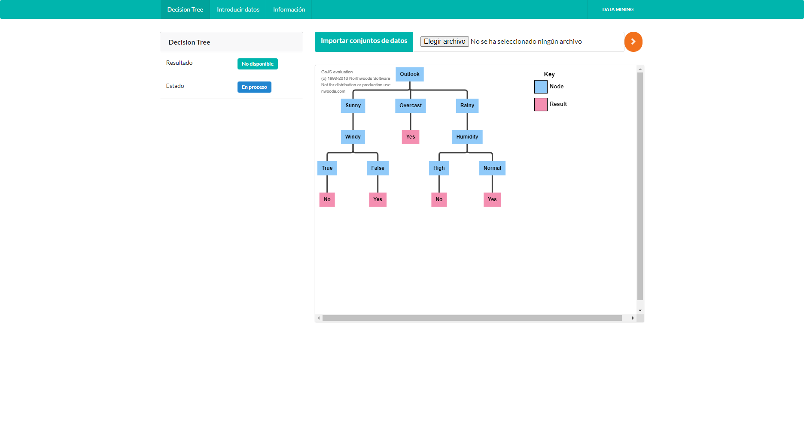

# Decision Tree App

------------
## General info

- Decision Tree helps to classify data, find rule sets, model and draw tree structures. Application in many fields of data mining.
- The application is built on HTML and Javascript web platforms. With the support of a series of interface libraries such as GoJS, SemanticUI, AngularJS...

## Demo

- <a href='http://eacc.ml/Decision-Tree-App/index.html'>Decision Tree App<a>
  
  
  ## Links

>- <a href='https://www.convertcsv.com/csv-to-json.htm'>Convert CSV to JSON<a>
>- <a href='https://github.com/ebercalderon/Decision-Tree-App'>Source Code<a>
>- <a href='http://eacc.ml/Decision-Tree-App/index.html'>Demo<a>